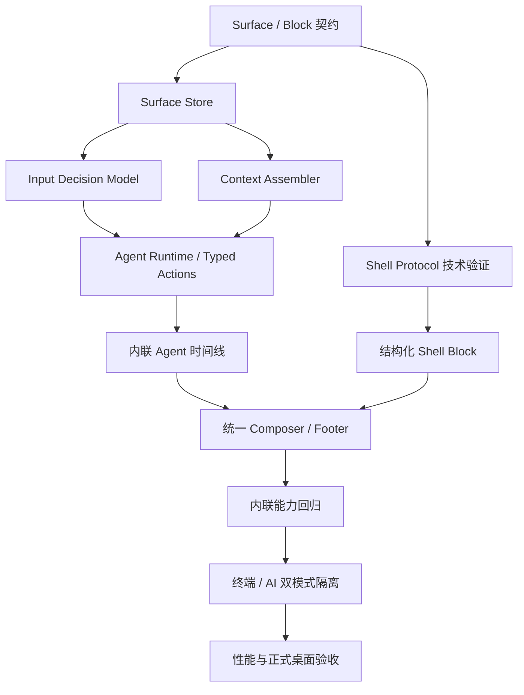

# Agent 原生终端迁移计划

## 1. 目标

把 Termexa 演进为按终端标签隔离的 Agent-native surface，同时保留显式打开的传统
AI 面板：

- Shell 命令和自然语言共用一个输入入口。
- Shell 输出、Agent 回复、执行过程、审批和总结进入同一 Block 时间线。
- Agent 可以连续执行、接受追加要求、暂停和交还控制权。
- 默认使用终端内联 Shell/Agent；点击顶部 AI 时进入传统 AI 面板模式，并隐藏内联模式控件。

本计划不以“看起来像 Warp”为验收，而以状态、执行和终端行为真正闭环为验收。

视觉收口时仅参考本机 `D:\2028\termany` 的主题背景图片机制：允许主题提供背景图层，
但不参考其界面布局、控件样式、配色 token 或字体。背景不得降低终端文本对比度，也不得
改变本计划的 Agent 架构。

## 2. 当前基线

已完成：

- 独立分支：`codex/agent-native-terminal`
- 保守的 Shell/Agent 输入分类和提示符识别
- `自动 / Shell / Agent` 模式
- 当前 SSH 标签定向 Agent 请求
- 12 轮续期、执行中追加要求、会话隔离
- `TerminalSurfaceState`、`TerminalBlock` 和控制权状态的第一版契约

当前限制：

- `AiPanel` 同时承担状态、Agent runtime、Markdown 渲染和右侧 UI，职责耦合。
- `TermEvent` 只有原始字节、连接和退出，无法可靠提供 command、cwd、exit code。
- Agent 命令运行在独立 SSH shell，与用户终端 PTY 的 cwd/环境并不天然相同。
- xterm canvas 不能直接插入会占据滚动高度的 React Agent Block。

## 3. 架构决策

### 3.1 唯一权威状态

每个终端标签对应一个 `TerminalSurfaceState`。标签 ID 是稳定身份，Surface 保存：

- 输入模式和当前控制权
- 有序 Block
- Agent conversation ID / runtime ID
- 草稿、流式状态、待审批动作和追加指令

UI 不再以 `AiPanel` 的局部 React state 作为权威数据源。

### 3.2 Agent 与上下文分离

- **Agent conversation**：用户目标、Agent 回复、工具调用和执行反馈。
- **Terminal context**：用户显式附加的终端输出、选中文本、环境信息。

切换 Agent 模式不清空 conversation；关闭标签才取消 runtime 并释放状态。上下文快照不能
自动变成对话历史，避免重复喂给模型。

### 3.3 混合终端模式

Block 时间线负责普通命令和 Agent 工作流。`vim`、`top`、`less`、密码输入、REPL 等交互程序
进入 Raw Terminal 模式，由 xterm 独占输入和渲染。退出交互程序后返回 Block 模式。

不尝试把全屏 TUI 强行渲染成 DOM Block。

### 3.4 双模式互斥显示、状态隔离

- **终端模式（默认）**：显示内联 Shell/Agent、Block 时间线与统一 Composer。
- **AI 模式（显式打开）**：恢复现有右侧 `AiPanel` 体验，并隐藏终端内联 Shell/Agent
  模式栏和 Composer，避免同屏出现两个 AI 输入入口。
- 两种模式使用不同的 conversation、draft、runtime key、执行通道和追加队列，不共享聊天历史。
- AI 模式可以在用户勾选上下文时显式读取当前终端输出，但这不等于共享内联 Agent 状态。
- 切换模式只改变可见性，不销毁另一模式的任务；关闭标签时同时取消并清理该标签两套 runtime。

### 3.5 三个状态域必须独立

结合用户提供的界面截图，统一输入体验由三个互不替代的状态域组成：

| 状态域 | 负责什么 | 不负责什么 |
| --- | --- | --- |
| Input Route | 当前输入进入 Shell 还是 Agent | 不决定 Agent 是否自动执行 |
| Context Policy | Agent 本轮能读取哪些终端信息 | 不代表开启 Agent |
| Execution Policy | 安全命令自动执行、危险动作审批 | 不改变输入分类 |

具体状态：

- `InputRoute = auto | shell-locked | agent-locked`
- `ContextPolicy = none | recent | selected-blocks`
- `ExecutionPolicy = safe-auto`（本轮固定，不提供易混淆的额外开关）

默认是 `auto + recent + safe-auto`。低风险只读动作可以自动连续执行；删除、覆盖、安装、
重启、权限变更和端口暴露始终进入审批。Execution Policy 不会改写输入路由或上下文开关。

### 3.6 自动感知输入

自动模式采用分层决策，而不是单个关键词正则：

1. **强制状态**：用户手动锁定 Shell/Agent、Raw Terminal、密码输入。
2. **Shell 高置信证据**：已知命令、路径、操作符、历史命令匹配、补全结果、脚本后缀。
3. **Agent 高置信证据**：中文/英文自然语言、问句、动作目标、上一条 Agent 回复的自然语言追问。
4. **低置信回退**：进入 Shell，避免误执行 Agent。

分类必须在本地即时完成，并返回 `target + confidence + decision source`。输入过程中 footer
实时显示目标；用户按 Enter 前可以通过快捷键或点击锁定另一模式。Tab、方向键或交互程序一旦让
输入缓存不可靠，本次提交强制交给 Shell。

### 3.7 上下文能力

上下文采用分层装配：

- **Surface 基础上下文**：host、port、username、shell、OS、cwd、连接状态。
- **最近上下文**：当前标签最近完成的 Shell Block、exit code 和有限输出。
- **对话上下文**：当前 conversation 内的用户目标、Agent 回复、工具调用和结果。
- **显式上下文**：用户选中的 Block、终端文本、远程文件或错误报告。

约束：

- 不把整个终端无限 scrollback 自动发送给模型。
- 不把同一命令输出同时作为历史消息和上下文附件重复发送。
- 切换标签只切换 Surface，不串用其他服务器上下文。
- Context footer 要能显示“已附加几个 Block/文件”，并允许移除。
- 达到上下文预算时先摘要旧 Block，保留原始 Block 在本地供用户展开。

### 3.8 Agent 能力

Agent 采用显式循环：

```text
用户目标 -> 观察上下文 -> 制定计划 -> 提议类型化动作
         -> 权限判断 -> 执行动作 -> 记录真实结果 -> 继续或完成
```

第一批类型化动作：

- `shell.execute`：有限时、可取消的非交互命令
- `terminal.readBlocks`：读取当前 Surface 的指定 Block
- `terminal.wait`：等待命令或服务状态
- `terminal.interrupt`：中断当前 Agent 命令

后续再接入 `sftp.*`、`forward.*`、`service.*` 等远程运维工具。模型输出不能再长期依赖
“从 Markdown 代码块猜命令”；迁移期允许兼容解析，但新 Runtime 内部统一转换成 typed action。

权限规则：

- 安全只读动作自动执行。
- 删除、覆盖、安装、重启、权限和网络暴露等危险动作显示“执行 / 修改 / 拒绝”。
- 用户输入新指令、点击停止或直接操作终端时，可以中断计划并重新规划。

## 4. 截图目标交互

### 流程一：输入 Shell 命令

1. 用户在底部统一输入框输入 `ss -tn | tail -n +2 | wc -l`。
2. 自动感知识别为 Shell，footer 显示 `Shell`。
3. 回车后生成 Shell Block，展示命令、输出、exit code 和 cwd。
4. 输入框保持在时间线底部，不打开任何侧栏。

### 流程二：自然语言追问当前结果

1. 用户紧接着输入“这些连接分别是什么状态”。
2. 自动感知识别为 Agent follow-up。
3. Context Assembler 附加上一条 Shell Block，而不是整个终端。
4. Agent 回复以内联 Block 出现在该命令之后，并给出解释或下一步建议。

### 流程三：建议命令

1. 用户输入“列出当前目录所有文件”。
2. Agent 生成 `shell.execute` 建议。
3. 若动作属于危险操作，显示“执行、修改、拒绝”；安全只读动作直接执行。
4. 执行结果成为同一 Agent conversation 下的执行 Block。

### 流程四：Agent 自动处理任务

1. 用户启用 `safe-auto`，输入“分析服务器性能问题”。
2. Agent 一轮规划多条互补的只读诊断动作，避免重复执行 uptime/free/top。
3. 每批执行过程默认折叠成一行，真实输出可展开。
4. 用户可在运行中追加要求；Runtime 在当前动作边界重新规划。

### 流程五：用户接管

1. Agent 运行时，用户点击停止或开始操作终端。
2. 当前 Agent 命令收到 interrupt，Surface 控制权回到用户。
3. conversation 和已完成 Block 保留。
4. 用户再次输入自然语言时继续同一上下文，除非明确“开始新会话”。

## 5. 目标依赖图



## 6. 分阶段任务

### Phase A：冻结基线和状态层

#### Task A1：冻结当前可运行基线

**范围：** 明确现有未提交改动归属，记录第一阶段验证结果，建立后续回滚点。

**验收：**

- [ ] 当前输入路由、续期和追加指令改动范围可独立说明。
- [ ] 测试、构建和桌面验证记录完整。
- [ ] 用户确认后再提交基线；确认前不提交。

**验证：**

- `node --experimental-strip-types --test tests/*.test.ts`
- `npm run build`
- `cargo test --manifest-path src-tauri/Cargo.toml`

**依赖：** 无
**规模：** S

#### Task A2：完成 Surface Store

**范围：** 在已有 `surfaceModel.ts` 上建立按 `surfaceId` 管理的 store/hook，并定义创建、
切换、关闭和清理语义。

**验收：**

- [ ] 20 个标签的 Block、草稿、模式和控制状态互不污染。
- [ ] 切换标签保留状态；关闭标签释放 runtime 和内存状态。
- [ ] Store 不保存 API Key、密码或普通终端原始无限输出。

**预计文件：**

- `src/agent/surfaceModel.ts`
- `src/agent/TerminalSurfaceProvider.tsx`
- `tests/surfaceStore.test.ts`

**依赖：** A1
**规模：** M

### Checkpoint A

- [ ] 状态测试通过，应用构建通过。
- [ ] Surface 生命周期经过代码审查。
- [ ] 不改变当前用户可见交互。

### Phase B：输入智能、上下文与 Agent Runtime

#### Task B1：建立 Input Decision Model

**范围：** 把现有启发式分类升级为 surface-scoped 决策模型，记录手动锁定、自动检测来源、
历史匹配和 Agent follow-up。

**验收：**

- [ ] 同一输入返回 target、confidence 和 decision source。
- [ ] 手动模式、自动模式、Tab/方向键降级和 Raw Terminal 优先级有测试。
- [ ] 输入模式按标签隔离，切换标签恢复。

**预计文件：**

- `src/terminal/inputRouter.ts`
- `src/terminal/inputDecisionModel.ts`
- `src/agent/surfaceModel.ts`
- `tests/inputRouter.test.ts`

**依赖：** A2
**规模：** M

#### Task B2：建立 Context Assembler

**范围：** 按 context policy 装配 host/env、最近 Block、conversation 和显式附件，并实施
去重、截断和摘要边界。

**验收：**

- [ ] `none/recent/selected-blocks` 输出可预测且可测试。
- [ ] 不跨 Surface，不重复附加相同输出，不包含 secret 配置。
- [ ] 上下文预算超限时返回明确摘要/截断元数据。

**预计文件：**

- `src/agent/contextAssembler.ts`
- `src/agent/surfaceModel.ts`
- `src/types.ts`
- `tests/contextAssembler.test.ts`

**依赖：** A2
**规模：** M

#### Task B3：抽离消息和执行协议

**范围：** 把 `UiChatMessage`、执行结果、轮次暂停、排队指令等类型映射为
`TerminalBlock`，并定义 typed action 兼容层，不移动 UI。

**验收：**

- [ ] 每种现有消息都有明确 Block 类型和状态转换。
- [ ] 流式消息通过稳定 Block ID 更新，不依赖“最后一条消息”。
- [ ] Agent conversation 与普通上下文仍然隔离。

**预计文件：**

- `src/agent/surfaceModel.ts`
- `src/agent/agentEvents.ts`
- `src/agent/agentActions.ts`
- `src/components/AiPanel.tsx`
- `tests/agentEvents.test.ts`

**依赖：** B1、B2
**规模：** M

#### Task B4：抽离 Agent Runtime

**范围：** 将 AI 流式请求、Agent 通道、批量命令执行、续期和追加要求从 `AiPanel`
移动到按 Surface 工作的 observe/plan/action/execute runtime。

**验收：**

- [ ] Runtime 不导入 React 组件或 DOM API。
- [ ] 每个 Surface 可独立 streaming/executing/paused，切换标签不锁住其他输入。
- [ ] 停止、关闭标签和连接断开都有明确取消结果。
- [ ] Markdown 命令兼容解析先转换为 typed action，再进入权限判断。

**预计文件：**

- `src/agent/AgentRuntime.ts`
- `src/agent/agentEvents.ts`
- `src/components/AiPanel.tsx`
- `src/App.tsx`
- `tests/agentRuntime.test.ts`

**依赖：** B3
**规模：** M

#### Task B5：隔离传统 AI 模式 Runtime

**范围：** `AiPanel` 保留原有 conversation、普通聊天和 Agent 操作体验，但执行通道移入
独立 registry，使用 `ai-panel:<surfaceId>` 命名空间；终端内联 Runtime 使用
`terminal:<surfaceId>`，两者不互相投影或复用状态。

**验收：**

- [ ] 旧侧栏功能行为不变。
- [ ] AI 面板与终端内联模式的消息、草稿、busy、queue 和 channel 完全隔离。
- [ ] 隐藏/重显侧栏不会中断 AI 面板正在执行的 Agent。
- [ ] 关闭标签会同时释放 `ai-panel:` 与 `terminal:` runtime。

**预计文件：**

- `src/components/AiPanel.tsx`
- `src/agent/TerminalSurfaceProvider.tsx`
- `src/App.tsx`
- `tests/surfaceStore.test.ts`

**依赖：** B4
**规模：** M

### Checkpoint B

- [ ] Agent 诊断、危险命令确认、12 轮续期和追加要求全部回归。
- [ ] 两个 SSH 标签可同时运行独立任务。
- [ ] 关闭其中一个标签不会影响另一个 Agent。
- [ ] 安全只读动作自动执行，危险动作始终进入审批。
- [ ] Context Policy 与固定 safe-auto Execution Policy 互不改写。

### Phase C：先实现内联 Agent 时间线

#### Task C1：拆出可复用 Block Renderer

**范围：** 从 `AiPanel` 抽离 Markdown、表格、代码、执行摘要和限制提示渲染。

**验收：**

- [ ] 表格、列表、行内代码和命令块显示与当前能力一致。
- [ ] 执行过程默认一行折叠，展开不改变输入区位置。
- [ ] Renderer 只接收 Block 和 action callbacks。

**预计文件：**

- `src/agent/TerminalTimeline.tsx`
- `src/agent/AgentBlock.tsx`
- `src/components/AiPanel.tsx`
- `src/App.css`

**依赖：** B5
**规模：** M

#### Task C2：在 Terminal Surface 内渲染 Agent Block

**范围：** 在当前终端标签内提供时间线 DOM 层，先显示 Agent Block；xterm 仍负责现有
Shell 区域，右侧栏继续作为回滚路径。

**验收：**

- [ ] Agent 请求和回复只出现在当前标签的内联时间线。
- [ ] 切换标签恢复各自时间线和滚动位置。
- [ ] 运行、错误、停止、追加、续期状态完整可见。

**预计文件：**

- `src/components/TerminalView.tsx`
- `src/agent/TerminalTimeline.tsx`
- `src/App.tsx`
- `src/App.css`

**依赖：** C1
**规模：** M

### Checkpoint C

- [ ] 用户先验收内联 Agent 信息密度和折叠样式。
- [ ] 此时仍不删除侧栏。
- [ ] 发现体验方向错误时可只回退 C2，不影响 Runtime。

### Phase D：Shell Protocol 风险验证

#### Task D1：定义结构化终端事件协议

**范围：** 扩展事件契约，表达 command start、output、exit、cwd、prompt 和 raw-mode，
但暂不注入真实 shell。

**验收：**

- [ ] 事件具有 surface/command 稳定 ID 和严格顺序。
- [ ] 原始字节与结构化事件来源清晰，不重复渲染。
- [ ] 未识别 shell 时自动退回现有 Raw Terminal。

**预计文件：**

- `src/types.ts`
- `src-tauri/src/terminal/mod.rs`
- `src/terminal/blockProtocol.ts`
- `tests/blockProtocol.test.ts`

**依赖：** A2
**规模：** M

#### Task D2：Bash/Zsh Shell Integration 技术验证

**范围：** 使用 OSC/唯一 marker 验证 preexec、precmd、cwd 和 exit code；只在测试会话
启用，不进入默认产品路径。

**验收：**

- [ ] `cd` 后 cwd 正确，普通命令 exit code 正确。
- [ ] 命令历史不出现内部 marker，输出不泄露协议文本。
- [ ] Tab、Ctrl+C、多行粘贴和非零退出码不回归。

**预计文件：**

- `src-tauri/src/terminal/shell_integration.rs`
- `src-tauri/src/terminal/ssh.rs`
- `src-tauri/src/terminal/mod.rs`
- `src-tauri/src/terminal/shell_integration_tests.rs`

**依赖：** D1
**规模：** M

#### Task D3：PowerShell Integration 后续技术验证（不属于本轮）

**范围：** 后续为本地 PowerShell 建立等价边界事件，验证 PSReadLine 和 prompt 函数
兼容性。本轮本地 PowerShell 保持 Raw Shell，该任务不阻塞 SSH Agent 闭环。

**验收：**

- [ ] 命令、cwd 和退出状态可稳定采集。
- [ ] 用户 profile、Starship、Tab 补全和 Ctrl+C 可用。
- [ ] 注入失败时明确降级 Raw Terminal，不阻止本地终端启动。

**预计文件：**

- `src-tauri/src/terminal/shell_integration.rs`
- `src-tauri/src/terminal/local.rs`
- `src-tauri/src/terminal/shell_integration_tests.rs`

**依赖：** D1
**规模：** M

### Decision Gate D

本轮只有 SSH Bash/Zsh 验证满足边界要求才进入结构化 Shell Block；本地 PowerShell
保持 Raw Shell，待 D3 完成后再单独开放结构化 Block。
若技术验证失败：

1. 内联 Agent 时间线继续推进。
2. Shell 保持单个 Raw xterm 区域。
3. 不伪造 exit code/cwd，不用提示符正则包装成“完整 Block”。

### Phase E：统一 Composer 与完整时间线

#### Task E1：结构化 Shell Block

**范围：** 把 shell protocol 事件归并为 `ShellBlock`，完成态进入时间线；交互程序切换
Raw Terminal。

**验收：**

- [ ] 普通命令准确显示 command、output、exit code、cwd。
- [ ] `vim/top/less/ssh/密码输入` 自动或手动进入 Raw Terminal。
- [ ] Raw 模式退出后可继续创建 Block。

**预计文件：**

- `src/components/TerminalView.tsx`
- `src/terminal/blockProtocol.ts`
- `src/agent/TerminalTimeline.tsx`
- `src/App.css`

**依赖：** C2、Decision Gate D
**规模：** M

#### Task E2：统一 Composer / Footer

**范围：** 建立唯一输入编辑器，接入自动检测、Shell/Agent 锁定、Tab、历史和提交。

**验收：**

- [ ] 同一标签不存在第二个输入框。
- [ ] Shell 命令、自然语言、Tab 补全、历史和多行粘贴行为明确。
- [ ] 输入目标变化有稳定提示，低置信提交仍回退 Shell。

**预计文件：**

- `src/terminal/TerminalComposer.tsx`
- `src/components/TerminalView.tsx`
- `src/terminal/inputDecisionModel.ts`
- `src/App.css`
- `tests/inputRouter.test.ts`

**依赖：** E1、B5
**规模：** M

#### Task E3：接入 Footer、上下文和执行策略

**范围：** Footer 分别控制 Input Route、Context Policy 和 Execution Policy，并接入
上下文附件、追加要求、停止和接管。

**验收：**

- [ ] 三个状态域分别显示和更新，不复用同一个开关或状态变量。
- [ ] Agent 执行中可追加要求；其他标签输入不受影响。
- [ ] Context chip 可查看和移除已附加 Block/文件。

**预计文件：**

- `src/terminal/TerminalFooter.tsx`
- `src/terminal/TerminalComposer.tsx`
- `src/agent/TerminalSurfaceProvider.tsx`
- `src/App.css`
- `tests/contextAssembler.test.ts`

**依赖：** E2、B5
**规模：** M

#### Task E4：控制权状态机

**范围：** 将 `idle/streaming/executing/waiting-approval/paused/raw-terminal` 的转换显式化。

**验收：**

- [ ] 每个状态允许的输入、停止、接管和恢复动作有测试。
- [ ] 危险操作只能从 waiting-approval 经用户确认进入 executing。
- [ ] 连接断开、标签关闭和超时都回到可解释的终止状态。

**预计文件：**

- `src/agent/surfaceModel.ts`
- `src/agent/AgentRuntime.ts`
- `src/terminal/TerminalComposer.tsx`
- `tests/agentControlState.test.ts`

**依赖：** E3
**规模：** M

### Checkpoint E：内联能力门禁

终端模式必须全部通过：

- [ ] 普通提问与 Markdown 表格
- [ ] 自然语言自动感知、Shell/Agent 手动锁定和 decision source 提示
- [ ] recent/selected context、附件移除和上下文预算
- [ ] Agent 自动批量执行
- [ ] 危险命令确认、修改和拒绝
- [ ] 执行过程折叠/展开
- [ ] 运行中追加要求和停止
- [ ] 12 轮继续/结束
- [ ] 上下文附加与诊断最近报错
- [ ] 标签切换恢复、关闭清理、断线处理
- [ ] Shell Tab/历史/粘贴和 Raw TUI

### Phase F：双模式与产品收口

#### Task F1：终端 / AI 模式互斥显示

**范围：** 保留顶部 AI 开关、`AiPanel`、宽度和 Resizer。AI 关闭时显示内联
Shell/Agent；AI 打开时显示传统侧栏并隐藏内联模式栏与 Composer。

**验收：**

- [ ] 任一时刻只显示一套 AI 输入控件。
- [ ] 关闭 AI 面板后恢复当前标签的内联草稿、Block 和运行状态。
- [ ] AI 面板与内联 Agent 可独立切换标签、追加、停止和续期。
- [ ] SFTP 继续自动隐藏 AI 面板，切回终端后恢复用户选择。

**预计文件：**

- `src/App.tsx`
- `src/components/AiPanel.tsx`
- `src/App.css`
- `src/components/Toolbar.tsx`（以实际组件为准）

**依赖：** Checkpoint E
**规模：** M

#### Task F2：性能和长会话治理

**范围：** 对长时间线做窗口化/折叠，限制无界输出进入 React 状态，验证 20 标签和 100 主机列表。

**验收：**

- [ ] 500 Block 时间线滚动和输入无明显卡顿。
- [ ] 后台标签不持续渲染或重复订阅。
- [ ] 大输出有截断/按需展开，关闭标签后无 Agent/PTY 悬空通道。

**预计文件：**

- `src/agent/TerminalTimeline.tsx`
- `src/agent/TerminalSurfaceProvider.tsx`
- `src/components/TerminalView.tsx`
- `tests/surfaceStore.test.ts`

**依赖：** F1
**规模：** M

#### Task F3：桌面端正式回归

**范围：** 在 Tauri dev 和正式构建中执行真实 SSH、Agent、SFTP、转发和终端输入回归。

**验收：**

- [ ] 深色/极夜/浅色和常见窗口尺寸无重叠。
- [ ] 正式桌面包不依赖 localhost 页面。
- [ ] 用户验收后才提交、合并和打包正式版。

**依赖：** F2
**规模：** M

## 7. 测试矩阵

| 维度 | 必测场景 |
| --- | --- |
| 输入 | Shell、中文自然语言、英文自然语言、路径、未知命令、Tab、方向键、粘贴 |
| 自动感知 | 手动锁定、历史匹配、Agent follow-up、低置信回退、Raw Terminal |
| 上下文 | none、recent、selected、去重、预算、摘要、跨标签隔离 |
| Shell | SSH Bash/Zsh、非零退出、cwd、Ctrl+C、断线重连；PowerShell 保持 Raw Shell |
| 交互 | Vim、Top、Less、密码、SSH 嵌套、REPL |
| Agent | safe-auto、typed action、流式、批量命令、危险确认、追加、停止、续期、超时 |
| 隔离 | 两个并发 Agent、20 标签切换、关闭单标签、关闭窗口 |
| UI | 三主题、窄窗口、分屏、长表格、大输出、500 Block |
| 回归 | SFTP、服务器间传输、端口转发、复制粘贴、系统托盘 |

## 8. 风险与处理

| 风险 | 级别 | 处理 |
| --- | --- | --- |
| shell integration 污染 profile/历史 | 高 | 独立技术验证、显式降级 Raw Terminal |
| xterm 与 DOM 时间线重复输出 | 高 | 定义唯一渲染来源，协议事件与 raw bytes 不双写 |
| Agent 独立 shell 与用户 PTY 环境不同 | 高 | 展示 Agent 执行环境；后续统一执行上下文前不声称共享 cwd |
| 双模式状态串用 | 高 | `terminal:` 与 `ai-panel:` runtime/conversation 命名空间完全隔离 |
| 分类误判导致错误执行 | 高 | 低置信回退 Shell；Input Route 与 Execution Policy 分离 |
| 上下文重复或跨主机污染 | 高 | Context Assembler 单点装配、Block ID 去重、surfaceId 强校验 |
| 模型用文本伪造工具动作 | 高 | 所有动作转换为 typed action 并重新做权限判断 |
| 长输出导致 React 卡顿 | 中 | Block 摘要、输出截断、窗口化、后台标签停止渲染 |
| 关闭标签遗留请求/通道 | 高 | Runtime 按 surface 销毁并测试取消语义 |

## 9. 执行纪律

1. 每次只实施一个 Task。
2. 每个 Task 完成后先测试、构建和代码审查，再进入下一项。
3. Checkpoint 必须用户验收，不能自动跨越。
4. `AiPanel` 保留为独立 AI 模式，不得读取或改写终端内联 conversation/runtime 状态。
5. 用户验收前不提交、不合并、不打正式包。

## 10. 下一步

用户确认本计划后，从 **Task A1：冻结当前可运行基线** 开始。A1 只整理现有改动和验证，
不继续增加功能；确认基线后再进入 A2。
